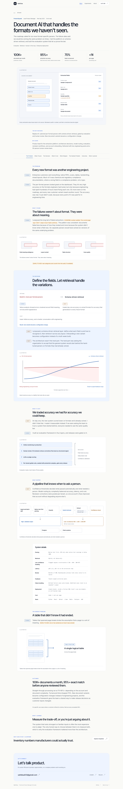
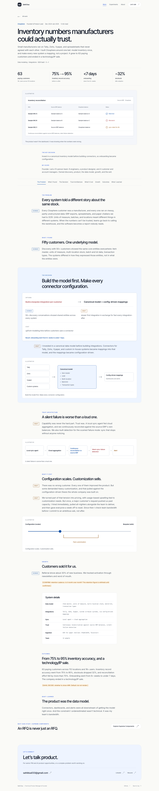
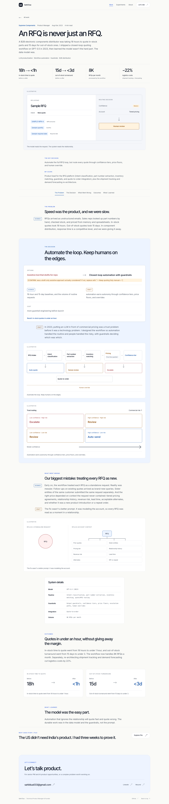
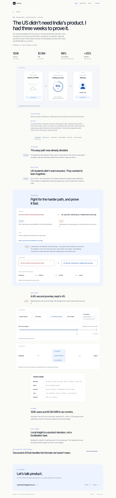

# Case studies v2: craft + science.

The v2 brief is the factual and editorial source of truth. The earlier diagram brief supplies the reusable primitives, science/craft/risk colors, SVG accessibility, and once-per-figure tracking at 50% visibility. Existing route URLs are preserved.

## Pages and visual coverage

| Page | Product artifact | Supporting figures |
| --- | --- | --- |
| ProductSquads | Document beside extracted fields, source bounding boxes, confidence and 300 DPI review note | Decision card, failure taxonomy, conceptual accuracy/cost curves, four-tier evaluation stack, extraction/review pipeline, table across a page break |
| Closphere | Reconciliation rows with matched, mismatch, and silent-sync states | Decision card, canonical inventory model, sync/reconciliation/alert flow, configuration/customization spectrum |
| Supreme Components | Annotated RFQ with account context and human-review routing | Decision card, guarded quoting flow, confidence/risk matrix, isolated RFQ versus account context, two before/after comparisons |
| Filo | Upload, matching countdown, and fictional matched tutor | Decision card, rejected/chosen launch paths and proof timeline, matching flow and latency budget, marketplace trust layer |

There are 24 figures across the four pages. Each has a caption and a nonempty, labeled SVG. Illustrative artifacts use fictional values. Qualitative charts have no numeric axis ticks. No new chart or animation dependency was added.

The shared page has a metric strip with definitions, 680px prose, wider diagrams, science/craft paragraph markers, one tinted Decision Moment, system details, and active contents navigation. Desktop contents stay sticky; mobile contents wrap above the narrative. The next-case sequence is ProductSquads → Closphere → Supreme → Filo → ProductSquads. Light and dark colors follow the device preference. Motion honors reduced-motion settings.

## Content requiring Sahil's review

These are intentionally unresolved and visibly flagged on the relevant pages. They are not presented as verified facts.

- [ ] ProductSquads: `[CONFIRM: number audited. The current page says "200+"; keep it only if Sahil confirms]`. The audit count is not asserted outside this confirmation note.
- [ ] ProductSquads: `[SAHIL TO ADD: real categories and counts from the audit, if available]`. Current category clusters are illustrative, without counts.
- [ ] ProductSquads: `[SAHIL TO ADD: one or two sentences on how it was solved]`, for stitching tables across page breaks.
- [ ] Closphere: confirm the retention measurement cadence, including whether it was month over month. The 90%+ retention claim is withheld from the rendered page.
- [ ] Closphere: decide whether to show ARR. The ₹4.7 Cr ARR figure is withheld by default; the decision notice remains visible.
- [ ] Supreme Components: confirm whether a draft-only assistive approach was actually considered. The rejected option is visibly marked as unconfirmed. The suggested fully manual alternative is not silently substituted.
- [ ] `CONFIRM NDA: client names`: Bosch, 3M, Sherwin-Williams, DuPont, Avery Dennison. None is rendered in the pages. The required comment remains in `content/case-studies.ts`.
- [ ] Supply Chain Compliance and Sustainability Platform: no distinct route or case with this title was found in the current implementation or design archive. Nothing was deleted, merged, or renamed. Sahil must identify its URL/file before any overlap decision.

## Contradictions and editorial decisions

- The previous Filo profile/résumé title was Product Manager. The v2 brief explicitly says Founding US PM; the case and About experience now follow v2. Confirm that title against the résumé before publishing.
- The Closphere team sentence says 12 people, then lists 6 engineers, 1 designer, and 4 customer/account managers, totaling 11. The founder may be the twelfth, but that is not confirmed. The provided sentence is preserved, not silently rewritten.
- Older case/source material used Closphere accuracy of 95%+ and Supreme volume of 8K+ RFQs. V2 specifies 75% → 95% and 8K, respectively. The pages use v2.
- The previous narrative asserted 200+ audited extractions. V2 explicitly marks this unconfirmed, so it is now a visible question rather than a claim.
- Old Closphere copy said technology sale and paying companies. Current site copy uses technology/IP sale and paying customers with user context.
- The generic hero instruction asks for two sentences, while the supplied deks contain three. The supplied deks are preserved verbatim.
- The earlier diagram brief requested extra decision cards, an ending metric strip, additional diagrams, and new learning placeholders. V2 supplies a different final narrative and one Decision Moment. V2 takes precedence.
- The downloadable résumé is a separate, existing PDF and has not been rewritten. It remains a consistency exception for the older role/metric wording. An updated résumé should be supplied or separately approved for editing before release; the source PDF outside the project was untouched.
- Historical design concepts and audit documents are not served by Next.js. They retain historical wording and do not define current facts. The automated copy check covers rendered pages, accessible labels, image alternatives, and metadata.
- No GPA is displayed in the site text. No grade was invented or rounded.

## Verification and screenshots

Run `npm run build` for compilation and types. Run the case suite against a local server:

```sh
NEXT_PUBLIC_POSTHOG_KEY=phc_local_test_not_a_real_project npm run dev -- --port 3002
# Separate terminal; SDK transport is intercepted and never reaches a real project:
TEST_ANALYTICS=1 npm run test:case-studies
```

The case suite checks all four pages at 375, 768, and 1440px in light and dark modes: 24 combinations. It checks every figure's rendered dimensions and accessibility labels, captions, contents highlighting, system details, case loop, horizontal overflow, forbidden copy, browser errors, WCAG A/AA automated rules, and exactly one `diagram_viewed` event per figure after repeated scrolling. Results are written to ignored `validation/case-studies-v2.json`.

Screenshots are in `screenshots/case-studies-v2/` at the project root. Focused hero and decision views live in the `review/` subfolder. These four full desktop images are suitable for the PR:






`diagram_viewed` properties are `case_study`, `diagram`, plus the shared `page_path` and attribution. Measurement is once per mounted figure at 50% geometric intersection. It is a visibility signal, not proof of reading. Actual project ingestion and project-side replay settings require the real public PostHog key. A locally mocked HTTP 200 does not verify them.

## Delivery status

The local implementation is complete. The production build and the 24-view case/diagram analytics suite pass. The separate analytics regression passed for attribution, interactions, engagement, masked replay snapshots, and heatmap payloads. The final production screenshot suite passes all 24 combinations. The broader regression passes 40 page/width combinations, accessibility scans, keyboard navigation, links, 200% text enlargement, and content without JavaScript. Results are recorded in the validation files. This folder has no Git repository or remote, and no GitHub repository URL has been supplied. No branch was pushed, no PR was opened, and no merge or deployment was performed. The intended branch is `case-studies-v2`; PR title: **Case studies v2: craft + science.** This report provides the proposed PR description and review checklist.

Once the repository is supplied, preserve its existing history and use the requested logical commits: shared primitives, one commit per case, site-wide consistency, then verification. Do not initialize an unrelated remote or merge to main.
